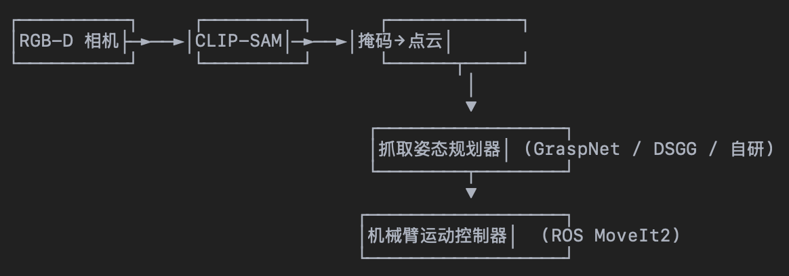

# CLIP-SAM-ONNX

一个同时使用 CLIP 与 Segment-Anything Model (SAM) 的 onnxruntime 推理项目。相比原始 SAM-ONNX (https://github.com/Dominic23331/sam_onnx)，本仓库新增了 语言提示词分割（CLIPSeg）功能。

SAM 目前支持三种提示类型：Mask / Point / Box。本项目通过 CLIPSeg 先粗分割，再把 Box+Foreground Point 传给 SAM，获得高质量掩码。

<p align="center">
  
</p>

## 前置准备

### 克隆仓库
```bash
git clone https://github.com/muggle-stack/clip-sam-onnx.git
cd clip-sam-onnx
```

### 安装依赖（推荐虚拟环境）
```bash
python -m venv .venv && source .venv/bin/activate
pip install -r requirements.txt
```

### 下载权重（示例以 ViT-B 为例）

```bash
cd models
wget https://dl.fbaipublicfiles.com/segment_anything/sam_vit_b_01ec64.pth

# 下载cli模型(下载模型的直接走终端代理，或者直接到huggingface下载放到models目录)
wget https://huggingface.co/Xenova/clipseg-rd64/resolve/main/onnx/model_quantized.onnx
```


## 模型转换

```bash
# 导出 decoder
python export_onnx_model.py --checkpoint sam_vit_b_01ec64.pth \
                            --output sam_decoder.onnx \
                            --model-type vit_b

# 导出 ViT encoder
python export_encoder_onnx_model.py  # 生成 sam_vit_b_encoder.onnx
```


## 推理使用

### 语言提示词（CLIP + SAM）

```bash
python inference.py \
  --img ./images/dog.jpg \
  --vit-model   models/sam_vit_b_encoder.q.onnx \
  --decoder-model models/sam_decoder.onnx \
  --clipseg-model models/model_quantized.onnx \
  --text "dog" \
  --device cuda --warmup 0 \
  --output dog_seg.jpg
```

### 交互手动分割（鼠标点击 / 拉框）

```bash
python inference.py \
  --img ./images/dog.jpg \
  --vit-model   models/sam_vit_b_encoder.q.onnx \
  --decoder-model models/sam_decoder.onnx \
  --device cuda --warmup 0 \
  --output dog_seg.jpg
```


## 机器人抓取集成指南

可以利用本项目的分割结果，生成三维抓取位姿并发送给机械臂，clip‑sam‑mask——输入一张 RGB 图 + 文本提示词，输出目标的二值掩码。

 系统整体流程

<p align="center">
  
</p>


## 参数说明

| 参数            | 必填 / 默认                     | 说明                                             |
|-----------------|---------------------------------|--------------------------------------------------|
| `--img`         | **必填** · `str`               | 输入图片路径                                     |
| `--vit-model`   | **必填** · `str`               | SAM ViT 编码器 ONNX 文件路径                     |
| `--decoder-model`| **必填** · `str`              | SAM prompt + decoder ONNX 文件路径               |
| `--device`      | `cpu` / `cuda` · 默认 `cpu`    | 推理设备                                         |
| `--warmup`      | `int` · 默认 `0`               | 热身迭代次数（可减少首帧延迟）                    |
| `--clipseg-model`| `str` · 默认 `""`             | CLIPSeg ONNX 路径；填写后启用文本提示分割         |
| `--text`        | `str` · 默认 `""`              | 文本提示词                                       |
| `--thr`         | `float` · 默认 `0.28`          | CLIPSeg 概率阈值（越高越严格）                   |
| `--kernel`      | `int` · 默认 `15`              | 膨胀核大小（掩码后处理，1 表示不膨胀）           |
| `--output`      | `str` · 默认 `""`              | 结果保存路径；若为空仅显示不保存                 |


## 许可协议  
- 项目代码：Apache-2.0  
- 模型权重：遵循原始发布者许可（SAM & CLIPSeg）。  


© 2025 muggle-stack. 欢迎 PR / Issue！  
